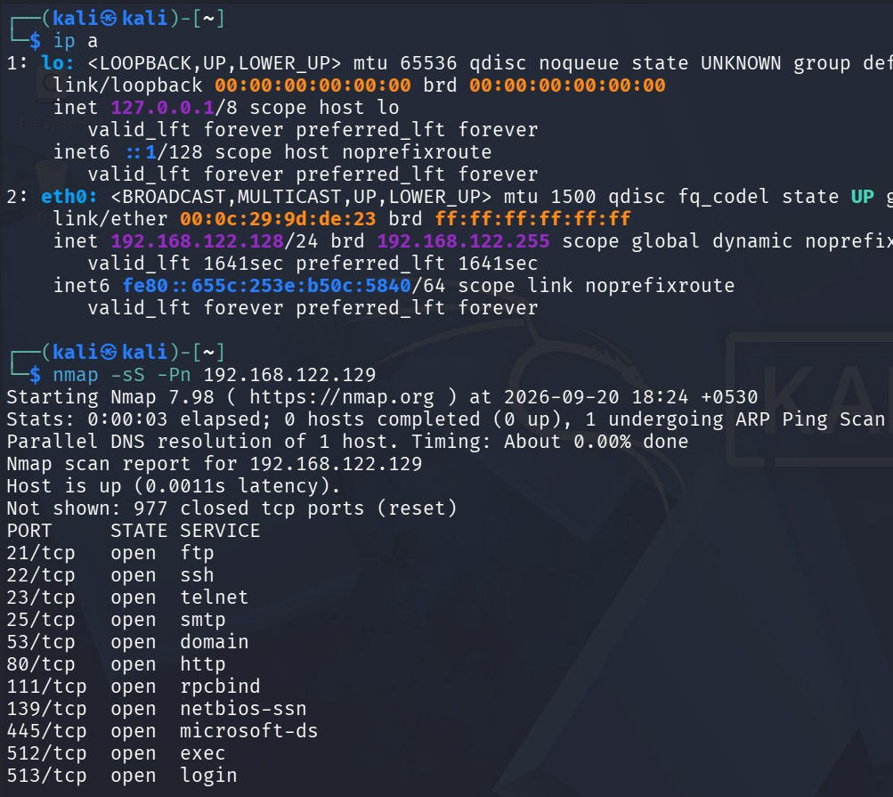
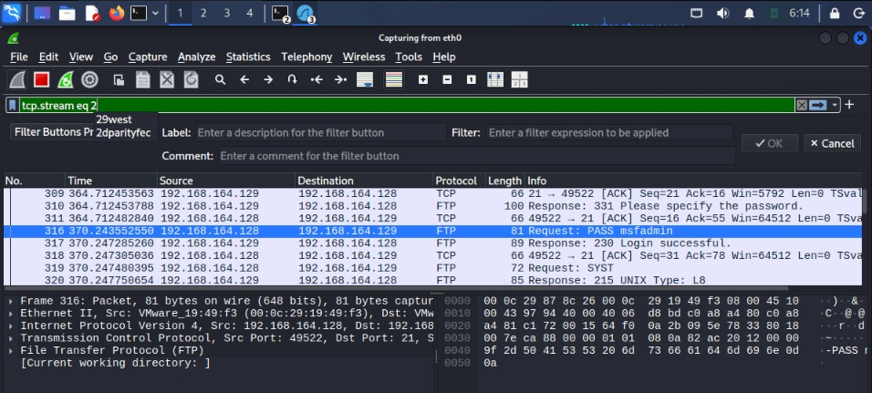

# Experiment 3: Capture and Analyze Network Traffic Using Wireshark

## Objective

To capture and examine network packets using **Wireshark** to detect suspicious activity and identify credentials transmitted in cleartext over an unencrypted network.

## Brief Theory

### Wireshark

Wireshark is a free, open-source network packet analyzer that captures and displays network traffic passing through a network interface in real time. It helps in analyzing communication between systems, identifying protocols, and detecting potential security issues.

### Network Packet Capture

Packet capture is the process of recording network packets transmitted between devices. These packets contain information about communication, including source and destination addresses, protocols, and data.

### FTP (File Transfer Protocol)

FTP is a network protocol used to transfer files between a client and a server. Traditional FTP transmits usernames and passwords in **cleartext**, making it vulnerable to network sniffing and credential theft.

### TCP Stream Analysis

TCP stream analysis allows the captured packets belonging to a TCP connection to be reconstructed into a readable communication session. It helps in examining the data exchanged between a client and server.

## Procedure

### Step 1: Configure the Kali Linux and Metasploitable Machines

Open the **Kali Linux** virtual machine as the attacker machine and the **Metasploitable** virtual machine as the target machine.

Configure both virtual machines to use a **Host-only Adapter** so they can communicate within an isolated lab network.

Use the `ifconfig` command on Kali Linux to identify its IP address. Verify connectivity with the Metasploitable machine using the `ping` command.

**Commands:**

```bash
ifconfig
ping 192.168.122.129
```


---

### Step 2: Identify the Network Interface and Scan the Target

Identify the active network interface on Kali Linux using the `ip a` command.

The network interface, such as `eth0`, is used to capture network traffic.

Perform an Nmap scan against the Metasploitable IP address to identify open ports and running services.

**Commands:**

```bash
ip a
nmap 192.168.122.129
```

The scan helps identify available services, including FTP, which will be used for traffic analysis.



---

### Step 3: Start Wireshark and Configure Packet Capture

Launch **Wireshark** on Kali Linux and select the active network interface, such as `eth0`.

Apply a capture filter to record traffic related to the Metasploitable IP address.

**Capture Filter:**

```text
host 192.168.122.129
```

Start capturing network traffic between Kali Linux and the Metasploitable machine.

The filter helps limit the captured packets to communication involving the target IP address.


---

### Step 4: Generate HTTP and FTP Traffic

While Wireshark is capturing packets, generate network traffic from the Kali Linux terminal.

Access the HTTP service running on Metasploitable using the `curl` command. Then, connect to the FTP service using the `ftp` command.

**Commands:**

```bash
curl http://192.168.122.129
```

```bash
ftp 192.168.122.129
```


.jpg)

.jpg)

---

### Step 5: Identify and Inspect FTP Packets

Open Wireshark and examine the captured packets.

Use the following display filter to identify FTP traffic:

Locate the FTP packets generated during the login session.

Select an FTP packet and use the **Follow → TCP Stream** option to reconstruct the communication between the FTP client and server.

This helps in examining the commands and responses exchanged during the FTP session.



---

### Step 6: Analyze the TCP Stream and Identify Cleartext Credentials

Examine the followed TCP stream to Observe the FTP commands and server responses transmitted during the login process, including the credentials
transmitted in cleartext:


---

## Result

The experiment demonstrated network traffic capture and analysis using **Wireshark**, revealing cleartext FTP credentials in the captured TCP stream.


## Conclusion

The experiment provided practical knowledge of network packet capture, FTP traffic analysis, and TCP stream reconstruction using Wireshark. It demonstrated how unencrypted network protocols can expose sensitive information and highlighted the importance of secure communication protocols.
